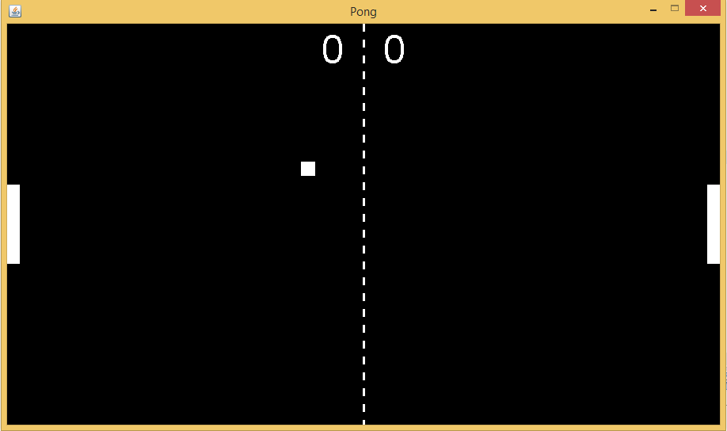

# SimplePong
Simple Pong Game as a first java project

Controls:

player 1 = W and S

player 2 = Arrow Up and Down

#################################################

TO DO:

1)Make a main menu

2)Increasing difficulty(maybe)
